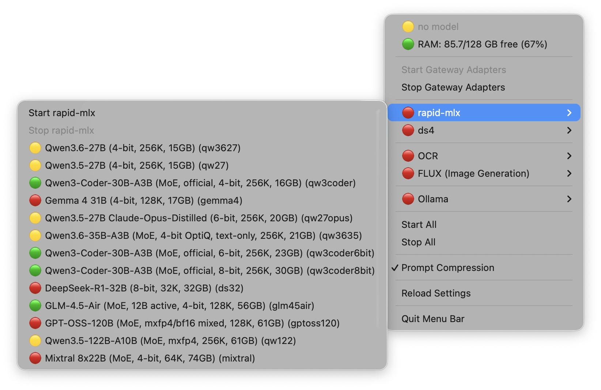

# Unified Gateway

[](https://go.dev)
[](LICENSE)
[](#requirements)

A lightweight Go proxy that lets **Anthropic-native** tools (like [Claude Code](https://github.com/anthropics/claude-code)) and **OpenAI-native** tools (like [OpenCode](https://github.com/sst/opencode)) share the same local LLM backend — with zero client-side changes beyond a base URL.

Point Claude Code at Unified Gateway's Anthropic adapter, point your OpenAI-compatible tools at its OpenAI adapter, and swap the model actually running underneath with a single command. The gateway also owns the lifecycle of the local model process itself, so there's no separate launcher script to keep in sync.

## Why

Local inference servers (`llama.cpp`-based tools, [`ollama`](https://ollama.com), MLX runners, etc.) generally speak one dialect — usually OpenAI's Chat Completions format. Claude Code, however, speaks Anthropic's Messages API: different request shape, different streaming event format, different tool-calling contract. Getting Claude Code to work against a local model means translating between the two — correctly, including edge cases most minimal proxies miss (system prompt placement, tool call streaming, conversation-compaction requests).

Unified Gateway does that translation, and adds model lifecycle management on top, so `some-model-tool serve` + a hand-rolled proxy script becomes one binary and one config file.

## Features

- **Dual protocol adapters** — a dedicated Anthropic Messages API port and a dedicated OpenAI Chat Completions port, both backed by the same underlying model
- **Correct Anthropic↔OpenAI translation** — `system` prompt (including prompts Claude Code sends interleaved mid-conversation, which most naive proxies miss), `tools`/`tool_use`/`tool_result`, and full SSE streaming translation in both directions
- **Conversation-compaction awareness** — recognizes Claude Code's summarization and auto-continue requests so they're observable instead of looking like malformed traffic
- **Model lifecycle management** — one command to hot-swap the active local model, whether it's served by a locally-spawned process or an already-running daemon like `ollama`, without restarting the gateway
- **Memory-safety check before every switch** — a locally-spawned model's on-disk weight size is checked against currently-free RAM (plus what killing the outgoing process will free up) before it's touched; a switch that would leave the machine short on memory is refused and the current backend is left running, rather than launching into a machine that's about to swap heavily or get killed by the OS under memory pressure
- **No port collisions, by design** — the gateway's own adapters, the model backend, and third-party tools (e.g. `ollama`) are always kept on distinct, non-overlapping ports
- **Optional background service** — install as a macOS `launchd` agent that starts at login and restarts on crash
- **Optional menu bar controller** — a small native tray app to start/stop the gateway, the model backend, and Ollama, and switch models, without a terminal
- **Live-toggleable prompt compression** — shrinks stale, duplicated, or oversized content in older messages before it ever reaches the backend, cutting both prefill time and KV-cache pressure on long-running sessions; on by default, no restart needed to flip it

## Architecture

```
                 ┌─────────────────────────┐
 Claude Code ──▶ │ Anthropic Adapter :8083 │──┐
                 └─────────────────────────┘  │
                                               ├──▶  active backend
                 ┌─────────────────────────┐  │      (rapid-mlx / ds4-server / ollama)
 OpenCode etc ─▶ │  OpenAI Adapter  :8082  │──┘
                 └─────────────────────────┘
```

The gateway process is stateless with respect to which model is loaded — every request re-derives which backend to route to live, by inspecting the real process on the backend port (rapid-mlx/ds4-server) or Ollama's own API, never from a cached value. An earlier version wrote a small state file on every `unified-gateway load <model>` and read it back per-request instead; it was removed after that file went stale the instant a backend process died on its own (crash, manual kill) and kept reporting a dead model as active indefinitely. This means switching between a locally-spawned inference process and an independent daemon like Ollama never requires restarting the gateway itself, and a backend dying outside of `load` is reflected immediately rather than papered over by memory of what used to be true.

## Requirements

- macOS (the model-launching and background-service tooling shell out to `lsof`, `launchctl`, and POSIX process groups)
- Go 1.26+
- At least one local inference backend: [`ollama`](https://ollama.com), an MLX-based server, or a `llama.cpp`-compatible server that exposes an OpenAI-compatible `/v1/chat/completions` endpoint

## Installation

```bash
git clone https://github.com/<your-username>/unified-gateway.git
cd unified-gateway
go build -o unified-gateway .
```

Copy the binary and your `models.json` (see [Configuration](#configuration)) into a directory on your `PATH`, e.g.:

```bash
mkdir -p ~/.local/bin
cp unified-gateway models.json ~/.local/bin/
```

`models.json` must always live next to the binary — that's how the gateway finds its model configuration and where it writes its runtime state.

## Configuration

Define your models in `models.json`:

```json
{
  "backend_port": 11435,
  "ollama_port": 11434,
  "media_backend_port": 11436,
  "flux_backend_port": 11437,
  "venv_dir": "~/path/to/your/mlx/venv",
  "ds4_dir": "~/path/to/ds4-server",
  "mflux_venv_dir": "~/path/to/your/mflux/venv",
  "flux_server_script": "~/path/to/flux_server.py",
  "models": {
    "my-mlx-model": {
      "path": "~/models/some-model-4bit",
      "label": "My MLX Model",
      "backend": "mlx",
      "model_type": "qwen3_5",
      "has_vision": true
    },
    "my-ollama-model": {
      "label": "My Ollama Model",
      "backend": "ollama",
      "ollama_model": "gemma3:27b"
    },
    "my-ocr-model": {
      "path": "~/models/some-vlm-ocr",
      "label": "My OCR Model",
      "backend": "mlx",
      "has_vision": true,
      "kind": "media"
    },
    "my-flux-model": {
      "path": "~/models/some-flux-checkpoint",
      "label": "My FLUX Model",
      "backend": "mflux",
      "model_type": "dev",
      "kind": "media"
    }
  }
}
```

| Field | Meaning |
|---|---|
| `backend_port` | Port that locally-spawned chat backends (`mlx`, `ds4`) listen on |
| `ollama_port` | Ollama's own port (default `11434`), independent of `backend_port` |
| `media_backend_port` | Shared port for every OCR-like (`"kind":"media"`, backend not `"mflux"`) entry — `backend_port + 1` by default |
| `flux_backend_port` | Shared port for every FLUX-family (`"kind":"media"`, `"backend":"mflux"`) entry — `media_backend_port + 1` by default |
| `venv_dir` | Python virtualenv containing your MLX-based server binary |
| `ds4_dir` | Directory containing a `ds4-server` binary, for GGUF-based models |
| `mflux_venv_dir` | Python virtualenv with [`mflux`](https://github.com/filipstrand/mflux) installed — only needed if you have `"backend":"mflux"` entries |
| `flux_server_script` | Path to the persistent server script that wraps mflux's Python API (see "Media models" under [Model discovery API](#model-discovery-api) below) — only needed for `"backend":"mflux"` entries |
| `models.<name>.backend` | `"mlx"`, `"ds4"`, `"ollama"`, or `"mflux"` (image-generation models only) |
| `models.<name>.ollama_model` | For `"ollama"` entries: Ollama's own model tag, if it differs from the shortname key |
| `models.<name>.kind` | `"media"` to keep a non-chat model (OCR, image generation) out of the chat catalog — see below. Omit for ordinary chat models |

## Usage

Start the gateway (both adapters run in the same process):

```bash
unified-gateway
```

In another terminal, load a model:

```bash
unified-gateway load my-mlx-model      # spawns/replaces the local inference process
unified-gateway load my-ollama-model   # no process spawned — just warms up the model in Ollama
```

`load` also starts the gateway itself if it isn't already running, so in practice you rarely need to invoke `unified-gateway` directly — `unified-gateway load <name>` is the one command you need day to day.

Point your tools at it:

| Client | Base URL |
|---|---|
| Claude Code | `http://localhost:8083` |
| OpenAI-compatible tools (OpenCode, etc.) | `http://localhost:8082` |

Example Claude Code settings:

```json
{
  "env": {
    "ANTHROPIC_BASE_URL": "http://localhost:8083",
    "ANTHROPIC_AUTH_TOKEN": "local",
    "ANTHROPIC_DEFAULT_SONNET_MODEL": "my-mlx-model",
    "ANTHROPIC_DEFAULT_HAIKU_MODEL": "my-mlx-model"
  },
  "model": "sonnet"
}
```

## Model discovery API

`GET /v1/models` on the OpenAI adapter (`:8082`) returns the full `models.json` catalog in the standard OpenAI shape (`{"object":"list","data":[...]}`), not just whatever the currently active backend happens to report — each entry is tagged `"active": true/false`. This is what lets an external client (a WebUI, say) discover which models exist and which one is loaded right now, without reading `models.json` off disk itself.

```bash
curl http://localhost:8082/v1/models
```

`POST /v1/models/<name>/load` triggers loading that model in the background and returns immediately (`202 Accepted`) — it can take minutes, so this doesn't hold the connection open waiting, the same way Ollama/LM Studio handle model loads. Works the same regardless of which backend `<name>` maps to in `models.json` (`mlx`, `ds4`, or `ollama`) — it's the same underlying `loadModel` the CLI and the auto-recovery path already use, so there's nothing backend-specific about this endpoint. Poll `GET /v1/models` afterward (or just retry your `/v1/chat/completions` call — it already self-heals on an unreachable backend, and on a *mismatched* one too, see below) to see when it's ready.

```bash
curl -X POST http://localhost:8082/v1/models/my-model/load
```

Every `loadModel` call — this endpoint, `unified-gateway load` on the command line, and the automatic recovery when a request hits an unreachable backend — is serialized through a cross-process file lock (`load.lock`, next to the binary), so two overlapping load requests from different sources queue up and run cleanly one after another instead of racing on the backend port.

**Self-heals on a mismatched model too, not just an unreachable one.** Both adapters compare the request's `model` field against whichever backend is *actually* active before forwarding anything — if a different model is loaded (left over from another client, a manual test, anything), that used to just get forwarded anyway: rapid-mlx correctly 404s a name it isn't serving, but nothing looked at that and reacted. On the Anthropic adapter specifically this was worse than a plain error — the response translator has no `choices` to work with in an error body, so it returned `{"error":"no choices found"}` wrapped in an HTTP 200, which from Claude Code's side is indistinguishable from getting no response at all. A mismatch now triggers the same `ensureBackendLoading` the unreachable case already used, and returns `503` immediately with a clear message instead of proxying to a backend that can't serve it; the Anthropic adapter also now propagates the backend's real status code on any non-200 response rather than always answering 200. Verified directly: a request naming a model other than whatever was active reproduced the silent failure, then came back fixed — immediate `503`, background switch, and a normal correct response on retry.

**Media models are kept out of the chat catalog.** Some `models.json` entries aren't meant to be a chat pick — OCR being the first example: it's a real `mlx`-backed, rapid-mlx-servable model (`has_vision: true`), but its only use is "read this image," not conversation. Tagging an entry `"kind": "media"` excludes it from `GET /v1/models` entirely (so OpenCode/pi/Claude Code never list it as a chat choice) and gives it its own listing instead:

```bash
curl http://localhost:8082/v1/media-models
```

It's still fully loadable the normal way (`unified-gateway load ocr`, the menu bar's own "Media Models" section) — `kind` only affects which catalog view it shows up in, not whether the gateway can serve it. This is *not* where image-generation models (FLUX, etc.) belong — those need [`mflux`](https://github.com/filipstrand/mflux), a completely separate runtime the gateway doesn't spawn or route to at all, so they're never added to `models.json`; see `~/ai/models.txt` for how those are tracked instead.

**Media models form two pools, each running concurrently with the chat backend and with each other, never instead of them.** Switching between two *chat* models is deliberately exclusive — they share `Config.BackendPort`, and loading one kills whatever was there, because rapid-mlx/ds4-server only serve one model per process. Media models keep that same exclusivity *within their own pool*, but the pools themselves are fully independent: OCR-like entries (any `"kind":"media"` model except `"backend":"mflux"`) share `Config.MediaBackendPort`, FLUX-family entries (`"backend":"mflux"`) share `Config.FluxBackendPort`. Loading `flux2-klein-4b` kills `flux1-dev` if it was running (same pool, same as switching chat models) — but never touches OCR or whatever chat model is active, and vice versa. This is the same non-exclusive relationship Ollama already has with the chat backend, just split into two pools instead of one daemon. Both adapters route a request to whichever pool's port matches its `model` field once that specific model is confirmed active there (auto-loading it via the same `ensureBackendLoading` chat models use, otherwise), and the memory-safety check only ever credits/kills whatever was previously on *that* pool's port — so a chat model, an OCR model, and a FLUX model genuinely resident at once is expected, not a bug.

**A third backend, `"mflux"`, exists solely for media-kind image-generation models.** mflux (the [Python library](https://github.com/filipstrand/mflux) FLUX models run on) has no server mode — every `mflux-generate*` command loads the model, generates one image, and exits, which makes "start once, stay loaded, auto-load on request" impossible with the CLI alone. `launchMflux` instead spawns a small persistent HTTP server (`flux-server/server.py`, tracked outside this repo — see `~/ai/models.txt` for where it lives and how it's installed) that wraps mflux's Python API directly: it loads the model once at startup and answers `POST /v1/images/generate` for as long as it stays up. `Config.MfluxVenvDir`/`Config.FluxServerScript` in `models.json` point at that script's own venv and file path; `ModelConfig.ModelType` carries mflux's own config-name alias (e.g. `"dev"`, `"flux2-klein-4b"`) so the script picks correct architecture defaults while still loading actual weights from `ModelConfig.Path` instead of triggering a fresh HuggingFace download.

**Verified end-to-end with `flux2-klein-4b`** (real image generated through the full stack: gateway load → `flux-server/server.py` → unicorn-server's `/v1/media/generate`). One caveat found the hard way: not every HuggingFace repo claiming to be a quantized FLUX checkpoint works with mflux — repos packaged for [flux.swift](https://github.com/mzbac/flux.swift) (e.g. `mzbac/flux1.dev.4bit.mlx`) use a different quantization packing and fail inside mflux's text encoder (`[dequantize] The matrix should be given as a uint32`) despite loading without error. Look for checkpoints explicitly quantized *with* mflux itself (e.g. `dhairyashil/FLUX.1-dev-mflux-4bit`) instead.

## Memory safety check

Before a `loadModel` call for a locally-spawned backend (`mlx` or `ds4`) kills the outgoing process and launches the new one, it checks whether there's actually enough RAM: the new model's on-disk weight size (summed `.safetensors` shards for `mlx`, the raw `.gguf` size for `ds4`) plus a 10% margin is compared against currently-free RAM (`vm_stat`'s free+inactive pages) plus what killing the current backend will free up (its live RSS). If that doesn't add up, the switch is refused with a clear error and the current backend is left running untouched — rather than launching into a machine that's about to start swapping heavily or get killed outright by macOS under memory pressure (this is what caused a full forced reboot in practice: a large model plus an already-loaded one together left no headroom at all). Ollama is exempt — it manages its own memory and isn't spawned/killed by the gateway.

The on-disk size is a proxy for the model's actual resident memory footprint, not an exact figure, but tracked closely against a hand-maintained table of known model sizes during testing (within ~1-2% in every case checked).

**rapid-mlx's prefix cache is capped, not left at its default.** rapid-mlx's memory-aware prefix cache defaults to reserving ~20% of *currently free* RAM (`--cache-memory-percent`), and reloads its persisted on-disk cache (`~/.cache/rapid-mlx/prefix_cache/`) into that reservation on every model start — observed directly at 9.4GB for a single 27B model, on top of the model's own weights, and scaling with however much free RAM happens to be around at that moment. That's real memory the weight-size check above never saw, so a switch could look safe and still leave the machine short once the cache system claims its share — worse the less free RAM there already is. `launchMLX` pins `--cache-memory-mb` instead of leaving it at that default — and the cap itself scales with model size (`mlxCacheReserveMBFor`): under 20GB gets 16384MB, under 45GB gets 8192MB, anything bigger gets 4096MB. A machine with plenty of free RAM can afford a much bigger cache for a small model (more repeated/shared-prompt hits), but a 70GB+ model already uses most of that headroom on weights alone and should stay conservative. The memory safety check above uses this same scaled value in its required-memory estimate for `mlx` backends, so it still reflects what rapid-mlx will actually claim regardless of which tier applies.

**TurboQuant and PFlash, for large-context workloads.** `launchMLX` also passes `--kv-cache-turboquant` (3-4 bit V-cache compression, K stays fp16) to every mlx model — verified directly, no restrictions found. `--pflash auto` (long-prompt prefill compression) is only added when `!m.HasVision`: rapid-mlx hard-refuses `--pflash` for any multimodal model, even one forced into `--text-only`/`--no-mllm` here, since its own check looks at the base model's vision capability rather than the runtime override. Found this the hard way — with both flags on unconditionally, rapid-mlx exited immediately with `--pflash is not supported for multimodal models`, and since the process died before ever binding the port, it looked from the gateway's side exactly like a hung load rather than a fast, explained failure. Every current `qwen3_5`-type catalog entry has vision, so PFlash presently only actually applies to the non-vision mlx models (DeepSeek, GPT-OSS, Mixtral).

## Prompt compression

Motivated by a real OpenCode session that reached 41,180 prompt tokens almost entirely from re-sent tool-call output accumulated across turns, not from the user's actual questions. `compressMessages` (`compress.go`) shrinks stale content in **older** messages only — the system prompt, tool schemas, and the last 6 messages are always forwarded untouched, so the model always sees full detail for whatever's actually relevant to the current turn. Two independent mechanisms:

1. **Duplicate collapse.** The exact same tool-result content re-appearing verbatim (e.g. the same file read twice) keeps only the last occurrence; earlier ones become a short placeholder. A second pass also catches **near-duplicates** — the same content re-read with only numbers, timestamps, or whitespace differing (a line number changed, a counter incremented) — via a normalized shape signature (digit runs and whitespace collapsed before hashing), since an exact-hash check alone misses these.
2. **Middle truncation / sparse-block selection.** Any remaining message body over ~4000 characters gets cut. Below ~150,000 total conversation characters, this is a plain head+tail truncation (800 chars kept on each side). Above that gate, a more targeted pass splits the content into blocks (on blank lines), always keeps the first and last block, and ranks the rest by how many keywords from the *current* user question they contain — keeping enough top-scoring blocks to hit ~35% of the original size. This is the same sink+tail+query-overlap idea rapid-mlx's own PFlash uses at the token level (see the KV-cache section above), applied here at the text level in Go before the prompt ever reaches the backend — so it helps every model/backend, not just PFlash-capable non-vision ones.

Both mechanisms are covered by `compress_test.go`; `compress_eval_test.go` and `compress_eval_sparse_test.go` are throwaway (not regression) evaluations that print before/after sizes on realistic conversation shapes — run with e.g. `go test -run TestCompressionEval_SparseAndNearDup -v`.

On by default (`PROMPT_COMPRESSION=0` to start with it off instead), and toggleable live without a restart:

```bash
curl http://localhost:8082/v1/compression                                  # {"enabled":true,"requests_compressed":N,"chars_saved":N}
curl -X POST http://localhost:8082/v1/compression -d '{"enabled":false}'    # flip it
```

The menu bar app (below) exposes the same toggle as a checkbox, with cumulative savings in its tooltip.

## Running as a background service (macOS)

Two small standalone commands manage a `launchd` LaunchAgent that starts the gateway at login and restarts it if it crashes:

```bash
go build -o install-service ./cmd/install-service
go build -o uninstall-service ./cmd/uninstall-service

./install-service     # registers + starts now, idempotent
./uninstall-service   # stops + removes
```

`install-service` requires `unified-gateway` and `models.json` to already be present next to it. It writes `~/Library/LaunchAgents/local.unified-gateway.plist` and logs to `~/Library/Logs/unified-gateway/`. It manages the gateway process only — load a model separately with `unified-gateway load <name>`.

## Menu bar controller (macOS)

`cmd/menubar` is a standalone tray app (using [`getlantern/systray`](https://github.com/getlantern/systray)) for controlling everything without a terminal:

<p align="center"></p>

Reading it top to bottom:

- **`🟡 no model`** (or `🟢 <model-name>` / `🔴 stopped`) — what the gateway is *actually routing to right now*, asked directly of the gateway itself (`GET /v1/models` on its own OpenAI adapter). Green means it's up and serving a model; yellow means the adapters are up but nothing is loaded; red means they're stopped. Below it, **Start/Stop Gateway Adapters** are mutually exclusive — whichever doesn't apply right now is grayed out.
- **`rapid-mlx`** / **`ds4`** — one entry per local backend, each a submenu with its own **Start**, **Stop**, and a list of the models configured for that backend (`models.json`'s `"backend": "mlx"` / `"ds4"` entries); clicking a model loads it directly. The 🟢/🔴 dot and model name are read straight from the real process's own command line (which one owns the backend port, and its `--served-model-name`/`--model` argument) — not from a state file this tool wrote earlier, so it's still correct even if that process was started or replaced by something else.
- **`Ollama`** — same shape, but for the independently-running Ollama daemon: **Start Ollama**/**Stop Ollama** plus the list of `"backend": "ollama"` models to warm up. Whether it's running comes from checking the process itself, and which model it has loaded comes from Ollama's own `/api/ps` — so stopping Ollama by hand, outside this tool, is reflected immediately too.
- **`OCR`** / **`FLUX (Image Generation)`** — one section per media pool, appearing only if `models.json` has entries for it. Same shape as `rapid-mlx`/`ds4` above: one shared **Start**/**Stop** and a model list, switching within the pool is exclusive (loading a different FLUX model kills the previous one). Neither pool ever touches the chat backend or the other pool.
- **Start All** / **Stop All** — bulk versions of the above.
- **Reload Settings** — the model list is only read from `models.json` once, at startup, and there's no clean way to rebuild an existing systray submenu tree in place — so this relaunches a fresh copy of the app (which reads `models.json` fresh) and quits the current one. Use it after editing `models.json` by hand, or after `unified-gateway` itself changes it.
- **Quit Menu Bar** — closes only this tray app. It never touches the gateway, the model backend, or Ollama; see [below](#why-two-separate-launchagents) for why.

**Port conflicts are handled at click time, not as a status you have to interpret.** Clicking any "Start" item first checks whether its target port is already occupied by something else; if so, a native confirmation dialog asks whether to stop it and proceed. Switching between models *within* the same backend (clicking a different model in `rapid-mlx`'s own list, say) never prompts — that's the everyday case and stays as frictionless as running `unified-gateway load <name>` directly.

```bash
go build -o unified-gateway-menubar ./cmd/menubar
cp unified-gateway-menubar ~/.local/bin/
```

It's registered as its **own, separate** LaunchAgent from the gateway's:

```bash
go build -o install-menubar ./cmd/install-menubar
go build -o uninstall-menubar ./cmd/uninstall-menubar

./install-menubar     # registers + starts now, idempotent
./uninstall-menubar   # stops + removes
```

#### Why two separate LaunchAgents

This is deliberate, not an oversight: `local.unified-gateway` (the actual API service) and `local.unified-gateway-menubar` (this tray app) are independent LaunchAgents. Both use `KeepAlive` with `SuccessfulExit: false` — restart on an unexpected kill (crash, or `jetsam` terminating it under memory pressure, observed happening moments after `RunAtLoad` during a memory-pressure-triggered reboot, which otherwise left the tray icon gone until manually restarted), but not after a clean, deliberate exit. For the gateway that means any crash; for the menu bar app specifically, it means "Quit Menu Bar" (`exit(0)`) is respected and stays down until next login, since it's a convenience layer, not something else depends on staying up. Either way, quitting or losing the menu bar app never affects the gateway itself, which keeps serving requests regardless — they're independent LaunchAgents on purpose.

## Ports

| Interface | Port | Purpose |
|---|---|---|
| Anthropic Adapter | `8083` | Claude Code |
| OpenAI Adapter | `8082` | OpenCode and other OpenAI-compatible clients |
| Local backend (`mlx`/`ds4`) | `11435` (configurable) | The actively loaded chat model process |
| Ollama | `11434` (its own default) | Independent, always-on daemon |
| OCR-like media pool | `11436` (configurable) | Whichever `"kind":"media"` model (except `"backend":"mflux"`) is currently loaded — exclusive within this pool, independent of the chat backend |
| FLUX media pool | `11437` (configurable) | Whichever `"backend":"mflux"` model is currently loaded — exclusive within this pool, independent of the chat backend and the OCR-like pool |

## Known limitations

This gateway implements the Anthropic↔OpenAI translation needed for real-world Claude Code usage (including tool calling and streaming), but does not yet implement every edge case of Claude Code's wire protocol — notably prompt caching (`cache_control`), some request-shape optimizations around tool results, and IDE-specific tool sanitization. Contributions welcome.

## Contributing

Issues and pull requests are welcome. If you're adding support for a new backend type or a new Claude Code protocol edge case, please include a description of how you verified it (a `curl` transcript or a note on which client you tested against).

## License

[MIT](LICENSE)
